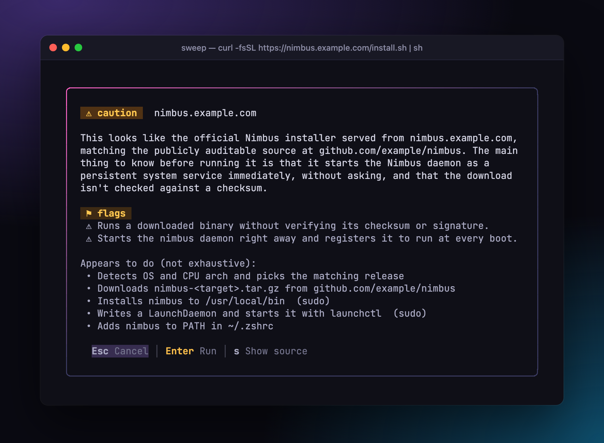
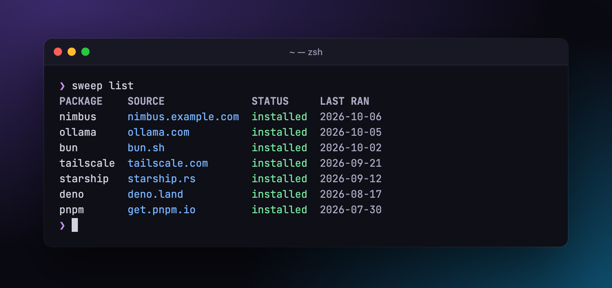

<div align="center">

<h1>🥌<br>Sweep</h1>

</div>

Sweep reads `curl | sh` installers before they run, tells you in plain English
what they're about to do, keeps track of everything you install, and keeps them
all up to date.

<h3>brew for the things you cannot brew.</h3>

| 🍺 brew          | 🥌 sweep                                                         |
| ---------------- | ---------------------------------------------------------------- |
| `brew install`   | `sweep 'curl -fsSL https://nimbus.example.com/install.sh \| sh'` |
| `brew list`      | `sweep list`                                                     |
| `brew upgrade`   | `sweep upgrade` _(soon)_                                         |
| `brew uninstall` | `sweep uninstall nimbus` _(soon)_                                |

## One word in front

Found an install command in some README? Just `sweep` before you `curl`

```sh
sweep 'curl -fsSL https://nimbus.example.com/install.sh | sh'
```

Sweep downloads the script, reads it, and shows you what it actually does,
before a single line runs:

<p align="center">
  
</p>

Like what you see? Press <kbd>→</kbd> <kbd>Enter</kbd> and it runs. Don't? <kbd>Esc</kbd>,
and nothing runs.

## Why Sweep

You trust 🍺 brew. Everything you installed is one `brew list` away. Updating is
one command. Then a README says `curl -fsSL https://… | sh`, and all of that is
gone:

- **You run it blind.** Hundreds of lines of shell, often with root access, and
  no idea what they'll change.
- **You forget it happened.** No list, no record, no way to see where that
  binary came from six months later.
- **You can't keep it current.** Every tool updates its own way, if it updates
  at all.

Sweep brings the brew feeling to everything else.

### 🔍 See before you run

Sweep reads the script and gives you a plain-language summary: what it
downloads, what it writes, which steps need `sudo`. Anything the review finds
worth a second look gets a flag. Scripts that try to sweet-talk the reviewer
into a clean report get flagged too.

Each review gets a clear verdict:

|   | Verdict                                                                  | To run it        |
| - | ------------------------------------------------------------------------ | ---------------- |
|   | **clear** — nothing unusual                                              | <kbd>→</kbd> <kbd>Enter</kbd> |
| ⚠ | **caution** — normal, with things you should know                        | <kbd>→</kbd> <kbd>Enter</kbd> |
| ✗ | **danger** — does something it shouldn't                                 | type `install`   |
| ⚠ | **analysis may be compromised** — the script tries to steer the reviewer | type `install`   |

Sweep never decides for you, and it never runs anything you didn't approve.

### 📋 Never lose track

Every approved install is recorded with its source and the exact script that
ran. One command shows what you've got:

<p align="center">
  
</p>

### 🔄 Keep it all current _(coming soon)_

Sweep already keeps the source of every install. Next up: `sweep upgrade` to
upgrade everything at once, and `sweep uninstall` to cleanly remove what you no
longer need.
